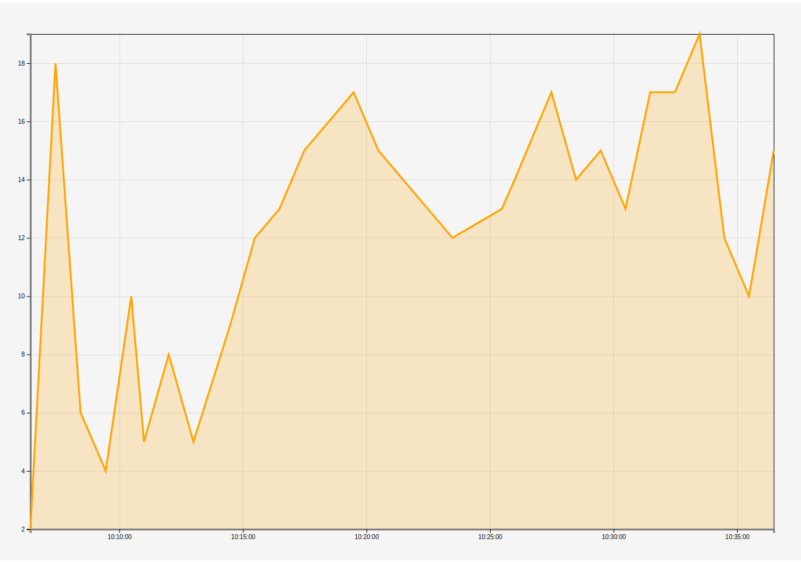

##  charts for finviz project
<p align="center">
<a href="https://travis-ci.org/EW4N7-2365-PT/d3chart/builds"></a>
<a href="https://david-dm.org/EW4N7-2365-PT/d3chart"></a>
<a href="https://david-dm.org/EW4N7-2365-PT/d3chart?type=dev"></a>
</p>

[demo](https://ew4n7-2365-pt.github.io/d3chart/)
#### Define config object
```javascript
const config = {
    height: /* in px */,
    width: /* in px */,
    margin: /* in px */,
    curve: /* eg. curveBasis default: urveCardinal */,
    resizeTime: /* resize animation time default: 0 */
};
```

#### Create chart
```javascript
const data = [
	{x: '10:6:24', y: 2},
	{x: '10:7:25', y: 18},
	{x: '10:8:26', y: 6},
	{x: '10:9:27', y: 4},
	{x: '10:10:29', y: 10},
	{x: '10:11:00', y: 5},
	{x: '10:12:00', y: 8},
	{x: '10:13:00', y: 5},
	{x: '10:14:29', y: 9},
	{x: '10:15:29', y: 12},
	{x: '10:16:29', y: 13},
	{x: '10:17:29', y: 15},
	{x: '10:19:29', y: 17},
	{x: '10:20:29', y: 15},
	{x: '10:21:29', y: 14},
	{x: '10:22:29', y: 13},
	{x: '10:23:29', y: 12},
	{x: '10:25:29', y: 13},
	{x: '10:26:00', y: 14},
	{x: '10:27:29', y: 17},
	{x: '10:28:29', y: 14},
	{x: '10:29:29', y: 15},
	{x: '10:30:29', y: 13},
	{x: '10:31:29', y: 17},
	{x: '10:32:29', y: 17},
	{x: '10:33:29', y: 19},
	{x: '10:34:29', y: 12},
	{x: '10:35:29', y: 10},
	{x: '10:36:29', y: 15},
];

new ChartClass('mount_element',config)
    .initChart()
    .provideData(normalizeData(data))
    .drawChart();
```



#### Resizing
```javascipt
    chartObj.resize(width,height);
```
#### Available effects
- AreaEffect
- DataPointEffect
- mouseTrackingEffect

#### Applying effects

```javascript
    chart.effects.add('mousetracking', new MouseTrackingEffect({/*config */}), true);
```